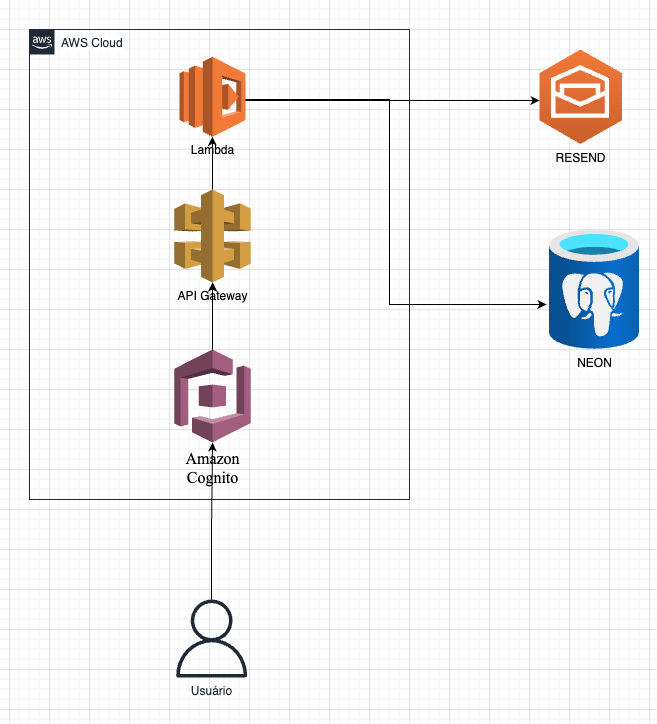

# 🏗️ Arquitetura da Aplicação

A arquitetura do projeto Integra foi desenhada com foco em simplicidade e uso de serviços em nuvem com cobrança sob demanda, utilizando a infraestrutura da AWS e serviços complementares.

Abaixo está a descrição dos principais componentes envolvidos na aplicação:

---

## 🔐 Autenticação

A autenticação dos usuários será feita por meio do **Amazon Cognito**, que gerencia o login por e-mail e senha, além de emitir tokens de acesso (JWT) utilizados nas chamadas autenticadas da API.

---

## 🌐 API e lógica de negócio

Toda a lógica de negócio será implementada em funções **AWS Lambda**, com arquitetura serverless.

Essas funções serão acessadas por meio do **Amazon API Gateway**, que atua como intermediador das requisições HTTP e também é responsável por validar os tokens de autenticação antes de encaminhá-las às Lambdas.

---

## 📬 Envio de e-mails

As notificações por e-mail, como atualizações de status e confirmações, serão feitas através do serviço **Resend**. Opcionalmente, pode-se utilizar o **Amazon SQS** entre a aplicação e o Resend para desacoplar os envios e garantir maior resiliência em ambientes com maior carga.

---

## 🗄️ Banco de Dados

O armazenamento dos dados será feito utilizando o banco de dados **Neon**, uma solução serverless baseada em PostgreSQL. Ele foi escolhido por oferecer compatibilidade com o ecossistema relacional e facilidade de integração com funções Lambda.

---

## 🔄 Diagrama de arquitetura

A imagem a seguir representa graficamente como os serviços se integram dentro da arquitetura do projeto:

📷 **`diagrama-arquitetura.png`**

---

## Observações

- A arquitetura está sujeita a ajustes conforme a evolução do projeto.
- Todos os serviços foram escolhidos com base em critérios de baixo custo e simplicidade de manutenção para um projeto acadêmico com potencial de continuidade futura.
